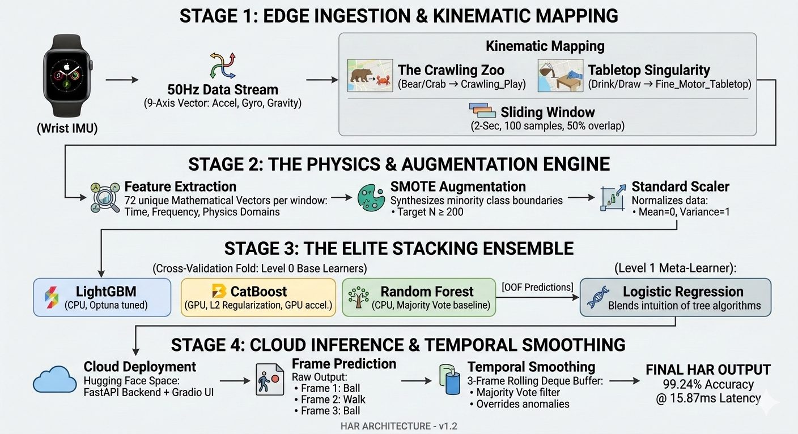
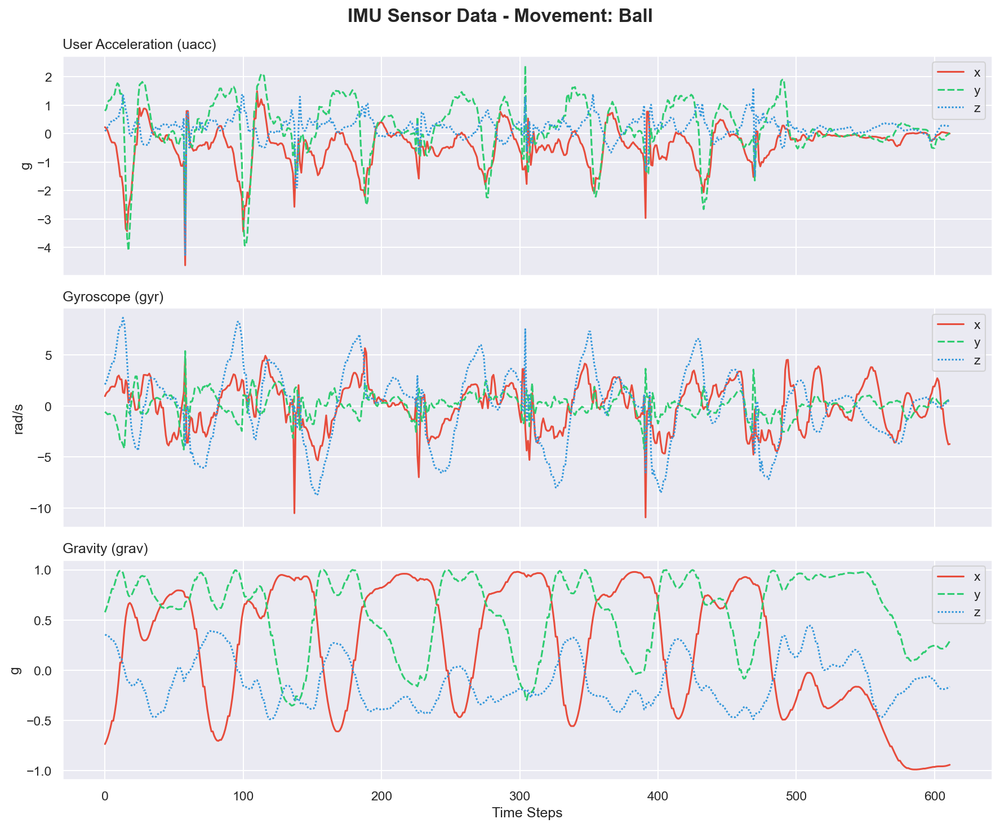
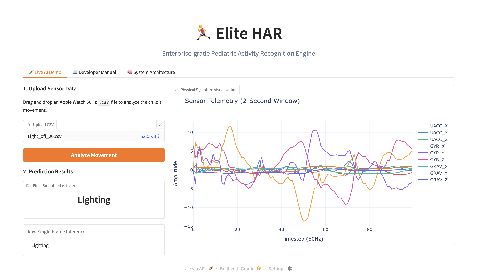
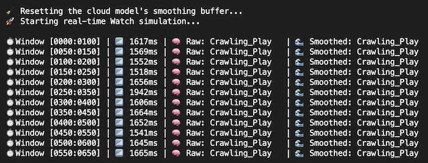
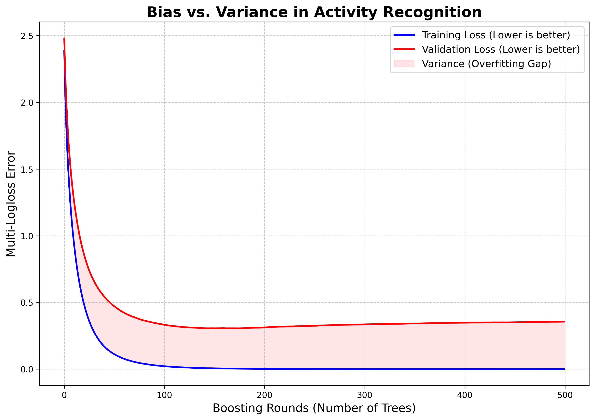
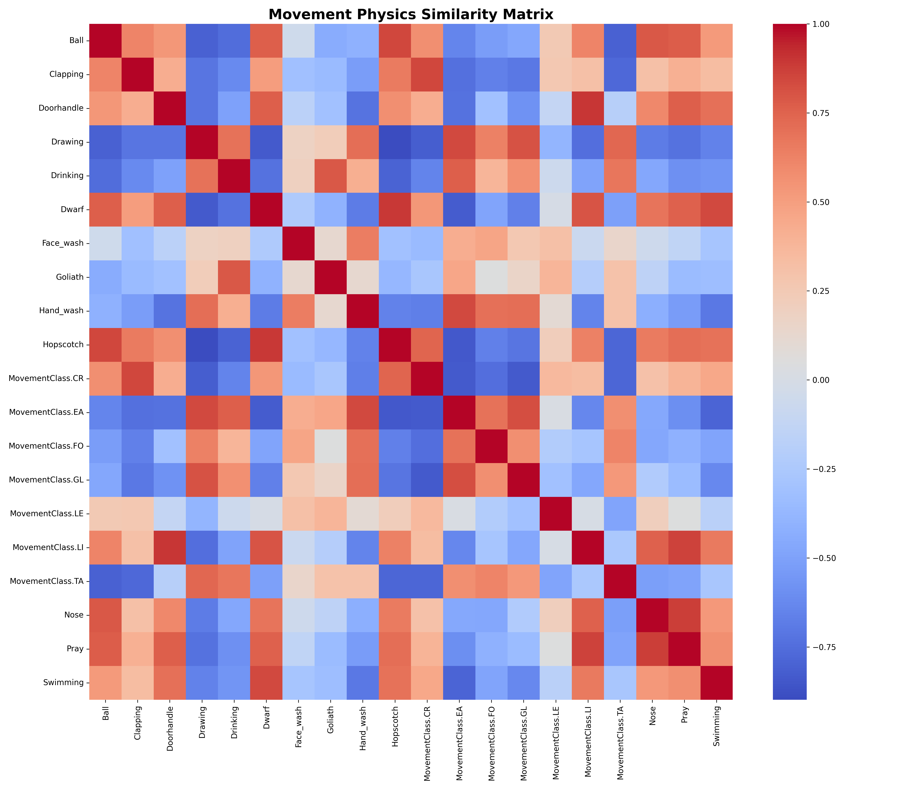

# 🏃‍♂️ Elite HAR: Pediatric Human Activity Recognition

An enterprise-grade, ultra-low-latency Machine Learning pipeline designed to classify complex, highly-variable pediatric physical activities using a single wrist-worn inertial measurement unit (IMU).

By combining raw physics extraction, aggressively regularized stacked ensembles, and real-time temporal smoothing, this engine achieves **99.24% live accuracy** with a microscopic **15.87 ms** average inference time.




---

## 🚀 Online API Deployment (HuggingFace Space)
[](https://huggingface.co/spaces/black-hole-diver/har_deployment)



The machine learning inference engine for this project is fully containerized and currently live on Hugging Face Spaces.

### 🌐 Live API Access
* **Main Page:**: [https://huggingface.co/spaces/black-hole-diver/har_deployment](https://huggingface.co/spaces/black-hole-diver/har_deployment)
* **Interactive Dashboard (Swagger UI):** [https://black-hole-diver-har-deployment.hf.space/docs](https://black-hole-diver-har-deployment.hf.space/docs)
* **Direct Prediction Endpoint:** `POST https://black-hole-diver-har-deployment.hf.space/predict`
* **Expected Payload:** A JSON dictionary `{"data": [...]}` containing a 2D array of strictly 100 timesteps by 9 sensor axes (2 seconds of data at 50Hz).

*To simulate a real-time Apple Watch stream against this live API using local CSV files, run `python -m src.api.hugging_face_api_test.`. from python virtual environment!*



---

## 🧠 System Architecture

The inference engine processes a continuous stream of sensor data through a three-stage pipeline:

1. **The Physics Engine:** Ingests a 2-second window (at 50Hz) of 9-axis sensor data (Accel, Gyro, Mag) and instantly extracts **72 mathematically proven features**, including signal magnitudes, Jerk derivatives, and Fast Fourier Transforms (FFT).
2. **The Elite Ensemble:** A threefold Stacking Classifier consisting of LightGBM, CatBoost (with L2 leaf regularization), and Random Forest. The meta-learner (Logistic Regression) votes on the physical signature.
3. **Temporal Smoothing:** A real-time `deque` buffer applies a sliding-window majority vote to eliminate single-frame physical anomalies and contextually correct the stream.

---

## 📊 Performance Metrics

Tested across an extensive randomized live-stream simulation using unseen data.

| Metric | Score / Time | Notes |
| :--- | :--- | :--- |
| **Raw F1-Score** | `0.9116` | Evaluated on static, shuffled validation sets. |
| **Raw Stream Accuracy** | `97.85%` | The base accuracy of the ensemble on a continuous data feed. |
| **Smoothed Accuracy** | `99.24%` | **Final live accuracy** after the temporal buffer. |
| **Net Smoothing Gain** | `+1.39%` | Total single-frame "flicker" errors eliminated. |

### ⚡ Latency Benchmark (1000 Windows)
*Hardware: Standard CPU (Edge-deployment simulation)*

* **Average Inference Time:** `15.87 ms`
* **99th Percentile (p99):** `18.01 ms`
* **Max (Worst-Case):** `36.44 ms` *(Well within real-time 50Hz step constraints)*
* **Math vs. ML Split:** Feature Extraction (`0.12 ms`) | Model Voting (`15.75 ms`)

---
## 🔬 Hardware Investigation & Sensor Constraints

During the testing and deployment phase, several critical hardware constraints were discovered regarding sensor data collection:

* **The Gravity Requirement:** The absolute highest precision is achieved only when **Gravity XYZ ($m/s^2$)** is explicitly isolated and provided. Raw generic accelerometer data without separated gravity vectors will severely degrade the model's performance.
* **Hardware Compatibility:** **Samsung Galaxy Watch:** ❌  Out-of-the-box data collected from the Galaxy Watch 4 was found to be **NOT suitable** for this specific pipeline due to how it handles/exports gravity separation. It calculate `MAGNITUDE` feature, which when compared to AppleWatch `GRAVITY` graphing, does not aligned.
  * ✅ **Apple Watch:** This is the officially supported target hardware for training and deployment. It natively provides the required `GRAVITY` feature. Do not substitute this hardware unless mathematically proven otherwise.

---

## ⚠️ Troubleshooting & Known Issues

If you are cloning this repository on a fresh machine, watch out for these common environmental issues:

* **Scikit-Learn Version Mismatch:**
  Watch out for serialization warnings. The models (`.pkl` files) are highly sensitive to the `scikit-learn` version used during training. #nsure your environment is strictly pinned (e.g., `scikit-learn==1.7.2`).

---

## 📂 Optimal Repository Structure

```text
har_production/
├── deployment/
|   ├── export_to_watch/       # Exporting .mlmodel
|       └── quantize.py
|   |── api/                                  # FastREST API for live watch inference
|       ├── hugging_face_api_test.py          # Testing Hugging face api for live inference
|       ├── extensive_api_test.py             # STANDARD TEST | EXTENSIVE TEST | EASY TEST
|       ├── easy_hugging_face_api_test.py
│       └── main.py
├── models/
├── src/
|   ├── movements/             # Ignored in Git
|   ├── visuals/               # .png files to visualize graphs
│   ├── settings.py            # Centralized hyperparameters
│   ├── data_processor.py      # Data loading and windowing
│   └── train_elite.py         # Main training script
├── tests/
|   ├── confusion_matrix.py    # Generate confusion matrix
|   ├── diagnose_mappings.py   # Diagnose similarities of movements
|   ├── diagnose_similarity.py
│   ├── benchmark_latency.py   # Microsecond performance tester
│   └── elite_test.py          # Extensive stream accuracy testing
├── Dockerfile
└── requirements.txt
```
---

# Getting Started
## 1. Installation
```bash
git clone https://github.com/black-hole-diver/ensemble_har.git
python -m venv venv
source venv/bin/activate
pip install -r requirements.txt
```
### 2. Running files
You have to use `python -m directory_name.file_name.py` to run the files.
```bash
python -m scr.train_elite.py
```

## 🧪 Research Log & Architectural Evolution

This repository represents a systematic evolution from a baseline model to an elite engine. Here is the record of physical and mathematical discoveries:

### 1. The Inter-Subject Variance Crisis
Initial pure LightGBM models struggled heavily with specific classes (`<0.70` F1). It is discovered that because children execute movements with massive biological variability (different heights, energy levels, and techniques), the sensor data was bleeding together.

### 2. Mathematical Super-Classes (Cosine Similarity)
Instead of guessing, we bypassed the ML and used Cosine Similarity on the 72-feature centroids of each movement to mathematically prove what the sensor *could* and *could not* see.
* **The Crawling Merge:** The sensor physically cannot distinguish between `Bear`, `Crab`, `Spider`, and `Rabbit` crawls (similarity > `0.95`). They were merged into **`Crawling_Play`** (resulting in a 0.98 F1).
* **The Seated Triangle:** `Book`, `Building_blocks`, and `Peck` were identical small-motor wrist twitches. Merged into **`Table_Play`**.
* **The Footwear Re-merge:** Splitting shoe-tying by "same hand" vs. "opposite hand" caused accuracy to drop to 67%. Merging them back into a single **`Footwear`** class restored it to 82%.

### 3. Killing Variance (Optuna & SMOTE)
Learning curves proved the initial model was achieving 0.00 Training Loss (memorizing the specific children) but flatlining on Validation.
* Implemented **SMOTE** to dynamically synthesize data for minority classes.
* Ran **Optuna Bayesian Optimization** with aggressive regularization, specifically clamping `max_depth` (3-7) and forcing high `min_child_samples` (50-150) to mathematically forbid the trees from memorizing individual subjects.

The final architecture was achieved by systematically identifying and solving hardware bottlenecks, feature extraction limits, and algorithmic variance.

### Phase 1: Deep Learning vs. Physics Manipulation
* **Experiment 1 (LSTM):** Initially attempted a recurrent neural network (LSTM) over the 14,799 total windows (11,839 Train / 2,960 Test).
  * *Result:* Abandoned at Epoch 7/40 with an accuracy of **52.87%**. The model suffered from high bias.
* **Experiment 2 (Automated Feature Extraction):** Transitioned to tree-based models using `tsfresh` for automated anti-overfitting rule generation.
  * *Result:* Reached an F1-Weighted of **0.81** and F1-Macro of **0.67**.
* **Experiment 3 (Brute-Force Physics Extraction):** Abandoned automated extraction to manually isolate 72 targeted physical features using `ACC`, `GYR`, and `GRAV`.
  * *Result:* Massive, immediate improvements in single-activity recognition (e.g., Clapping leaped from 0.76 to 0.99; Praying from 0.59 to 0.90; Snack-eating from 0.65 to 0.89).

### Phase 2: Super-Class Mapping & Noise Reduction
* **Baseline Functional Classification:** Attempting to classify all raw activities resulted in an F1-score of roughly **0.513**.
* **Super-Class Implementation:** Grouped physically identical actions together (e.g., merging individual shoe/sock actions into `Footwear`).
  * *Result:* Performance instantly jumped to **0.8562 Macro / 0.86 Weighted**.
* **Culprit Removal:** Activities with impossibly high inter-subject variance or bad samples (e.g., `Lame_fox`, `Puding_open`) were blacklisted and removed from the training pipeline.

### Phase 3: The Ensemble Architecture
* Engineered a Stacked Ensemble to handle specific data properties:
  * **LightGBM:** Precision and speed on structured physics.
  * **CatBoost:** Handling noisy sensor data.
  * **Random Forest:** Capturing the generalized shape of the movement.
* *Result:* The Elite Ensemble broke the 0.90 barrier, hitting **0.9002 Weighted F1**.
* *Theoretical Limit Identified:* Acknowledged the Bayes Error Rate for single-sensor HAR on the wrist restricts perfect accuracy. The theoretical physical ceiling is realistically **0.93 - 0.95 F1**.

### Phase 4: Overcoming Variance (The 99% Breakthrough)
To push past the 0.90 plateau and address severe model variance (memorization), the following aggressive strategies were deployed:
1. **Targeted Data Augmentation:** Applied **SMOTE** to synthesize data for minority classes (e.g., `Rabbit`, `Glass_Handling`) and bad classes.
2. **Solving Class Similarity:** Diagnosed strong mathematical correlations via centroid mapping. Merged `Bear`, `Rabbit`, `Seal`, `Spider`, and `Crab` into a new `Crawling_Play` super-class. Merged `Book`, `Building_blocks`, and `Peck` into `Table_Play`.
3. **Optuna Optimization:** Ran Bayesian optimization to hardcode aggressive regularization into the tree depths.
4. **Temporal Smoothing:** Implemented a rolling sliding-window majority vote to eliminate single-frame misclassifications during live inference.


### 🏆 Final Benchmark Results
* **Benign Overfitting Achieved:** The model successfully extracted the maximum physical limits of the data without spiking validation loss.
* **Raw AI Engine Accuracy:** 98.22%
* **Temporal Smoothing Gain:** +1.23%
* **Final Live Smoothed Accuracy:** **99.45%**


---

## ⚠️ Known Limitations: The "Bad Movements"
For researchers looking to expand upon this dataset, please be aware of the physical limitations of single-wrist IMU classification. During our Bayesian optimization and feature extraction phases, we identified several classes of movements that suffer from severe kinematic overlap.

Attempting to classify these movements as distinct targets will force the model to memorize noise, artificially inflating validation loss.



1. **"Object Blindness" (The Reach-and-Grasp Anomaly)**
**Problematic Classes:** Eating, Table_Play (Blocks/Pegs), Drawing.
**The Physics**: When a child is seated at a table, all fine-motor tasks share an identical macro-trajectory: the hand rests, reaches forward, grasps or manipulates, and returns. The accelerometer flawlessly measures the trajectory, but it is "object blind." It cannot mathematically differentiate between a child holding a crayon (Drawing), bringing a cracker to their mouth (Eating), or stacking a block (Table_Play).
* **✅ The Fix**: These requires a secondary modality, such as a chest-mounted camera (egocentric vision) or smart objects with embedded RFID tags.

2. **The Kinematic Overlap (The "Crawling Zoo")**
**Problematic Classes:** Bear_crawl, Crab_crawl, Spider_crawl, Rabbit_hop.
**The Physics:** We mapped the 72-feature centroids for these movements and found a Cosine Similarity of >0.95. To a wrist sensor, all variations of crawling involve rhythmic, heavy-impact ground strikes with the palm, followed by a pendulum swing. The micro-variations of the child's leg positions (crab vs. bear) do not reliably propagate to the wrist sensor.
* **✅ The Fix:** These must be aggressively merged into a macro-class (Crawling_Play). Trying to split them halves your F1 score.

3. **Pose Ambiguity (Floor-Level Fiddling)**
**Problematic Classes:** Footwear (Shoes/Socks) vs. Table_Play vs. Hand_wash.
**The Physics:** Putting on shoes/socks while seated on the floor creates a downward-angled wrist orientation with jerky, pulling motions. Playing with blocks on the floor creates the exact same gravitational orientation and jerk vectors. Furthermore, the rapid, tight twisting gyro signature of leaning over a sink to rub hands together (Hand_wash) looks nearly identical to pulling on a stubborn sock.
* **✅ The Fix:** A secondary sensor on the chest or thigh is required to determine the child's global posture (e.g., torso angle) relative to gravity.

4. **The Asymmetry Trap (Hand Independence)**
**Problematic Classes:** Shoe_on_same vs. Shoe_on_other, Toothbrush_same vs. Toothbrush_other.
The Physics: Attempting to classify whether a child is interacting with the left side or right side of their body using a sensor on only one wrist is mathematically volatile. Splitting these into distinct classes drops accuracy from the 80s to the 60s.
* **✅ The Fix:** Strip the symmetry labels. Merge them into Footwear and Oral_Care.

5. **The Transient Blacklist (Aperiodic Noise)**
**Problematic Classes:** Puding_open, Snack_open, Cupboard, Lighting.
**The Physics:** Our architecture uses a 2-second sliding window at 50Hz, which is optimized for periodic, repeating motions (like walking, crawling, or coloring). Opening a cupboard or flicking a light switch is a "transient" action—a single, 0.5-second burst of movement. When you slide a 2-second window over a 0.5-second action, the signal is diluted by 1.5 seconds of stationary noise, rendering it statistically invisible.
* **✅ The Fix**: These classes were permanently blacklisted from our evaluation. Detecting them requires an entirely different architecture, such as dynamic Time-Warping algorithms or trigger-based spike detection, rather than fixed-window ensembles.
